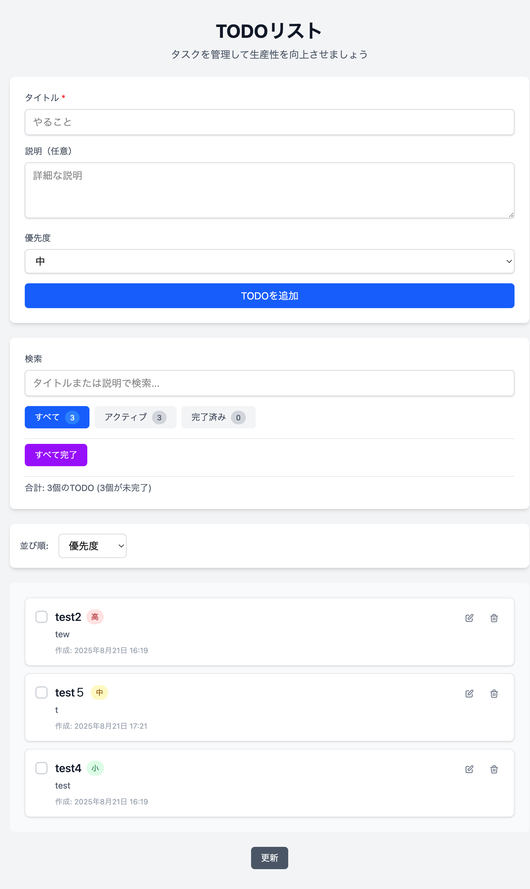

# serena 試した

## 先に結論

- 規模が小さいとそこまで効果は発揮しない (むしろ余剰かも)
- 規模が大きければ大きいほど恩恵は大きそう

## TODO アプリケーションを題材にする



## 与える指示は下記のみ

このアプリケーションにおいて、TODO アイテムに「優先度(高/中/小)」を設定して、優先度に応じて TODO アイテムをソートする機能を実装してください。

## モデルは Sonnet4 固定

Set model to sonnet (claude-sonnet-4-20250514)

## without-session

### 処理完了後の ccusage 結果

```
│ Session │ Models │ Input │ Output │ Cache Create │ Cache Read │ Total Tokens │ Cost (USD) │ Last Activity │
├─────────────────┼────────────────────┼───────────┼───────────┼───────────────┼──────────────┼───────────────┼─────────────┼───────────────┤
│ without-serena │ - sonnet-4 │ 288 │ 2,560 │ 56,247 │ 1,168,776 │ 1,227,871 │ $0.60 │ 2025-08-21 │
```

基本的には accept edits on で提案をそのまま受け入れた
lint エラーとか type エラーが解決するまで実施

## use-serena

### プロジェクトのオンボーディング

オンボーディングを開始させたときのログ (抜粋)

```
⏺ オンボーディングを開始します。プロジェクトの情報を収集していきます。

⏺ Update Todos
  ⎿  ☐ プロジェクトのディレクトリ構造を確認
     ☐ package.jsonやその他の設定ファイルを確認
     ☐ READMEファイルの内容を確認
     ☐ 主要なソースファイルの概要を確認
     ☐ テスト、リンティング、フォーマットのコマンドを確認
     ☐ プロジェクトの目的と技術スタックを特定
     ☐ メモリファイルを作成して情報を保存
```

```
# list_dir を実行して、プロジェクトのディレクトリ構造を確認します。
⏺ serena - list_dir (MCP)(relative_path: ".", recursive: false)
  ⎿  {
       "dirs": [
         "public",
     … +17 lines (ctrl+r to expand)

⏺ serena - list_dir (MCP)(relative_path: "src", recursive: true)
  ⎿  {
       "dirs": [
         "src/types",
     … +24 lines (ctrl+r to expand)
```

ディレクトリ構造を把握したあとは、`get_symbols_overview` などを使って、主要なコードシンボルの概要を解析してくれる。

解析がある程度終わったら、下記のように収集した情報が十分かを考えるように促される。

```
   serena - think_about_collected_information() (MCP)                                                                                                                    │
│   Think about the collected information and whether it is sufficient and relevant.                                                                                      │
│   This tool should ALWAYS be called after you have completed a non-trivial sequence of searching steps like                                                             │
│   find_symbol, find_referencing_symbols, search_files_for_pattern, read_file, etc.
```

不足している場合、追加で詳細な情報を把握しに行っている

その上でメモリファイルへの保存を行う。`write_memory`

```
⏺ Serena のオンボーディングが完了しました！

  以下の情報を収集し、メモリファイルとして保存しました：

  1. project_overview.md - プロジェクトの目的と技術スタック
  2. suggested_commands.md - 開発で使用する推奨コマンド
  3. code_style_conventions.md - コードスタイルと規約
  4. task_completion_checklist.md - タスク完了時のチェックリスト
  5. architecture_patterns.md - アーキテクチャとデザインパターン
```

この時点でのトークン量
│ Session │ Models │ Input │ Output │ Cache Create │ Cache Read │ Total Tokens │ Cost (USD) │ Last Activity │
├─────────────────┼────────────────────┼───────────┼───────────┼───────────────┼──────────────┼───────────────┼─────────────┼───────────────┤
│ use-serena │ - sonnet-4 │ 32 │ 4,649 │ 40,712 │ 1,087,127 │ 1,132,520 │ $0.55 │ 2025-08-21

### 指示を与える

指示を与えると、まずはプロジェクト構造を serena のメモリーから理解しようとします。

```
⏺ まず、プロジェクト構造を調査してTODOアプリケーションの実装を理解します。

╭─────────────────────────────────────────────────────────────────────────────────────────────────────────────────────────────────────────────────────────────────────────╮
│ Tool use                                                                                                                                                                │
│                                                                                                                                                                         │
│   serena - check_onboarding_performed() (MCP)                                                                                                                           │
│   Checks whether project onboarding was already performed.
.
.
```

```
⏺ serena - read_memory (MCP)(memory_file_name: "project_overview")

╭─────────────────────────────────────────────────────────────────────────────────────────────────────────────────────────────────────────────────────────────────────────╮
│ Tool use                                                                                                                                                                │
│                                                                                                                                                                         │
│   serena - read_memory(memory_file_name: "project_overview") (MCP)                                                                                                      │
│   Read the content of a memory file. This tool should only be used if the information                                                                                   │
│   is relevant to the current task. You can infer whether the information                                                                                                │
│   is relevant from the memory file name.                                                                                                                                │
│   You should not read the same memory file multiple times in the same conversation.

⏺ プロジェクト構造を理解しました。現在のTODOアイテムの型定義を確認しましょう。

⏺ serena - get_symbols_overview (MCP)(relative_path: "src/types/todo.ts")

╭─────────────────────────────────────────────────────────────────────────────────────────────────────────────────────────────────────────────────────────────────────────╮
│ Tool use                                                                                                                                                                │
│                                                                                                                                                                         │
│   serena - get_symbols_overview(relative_path: "src/types/todo.ts") (MCP)                                                                                               │
│   Use this tool to get a high-level understanding of the code symbols in a file.                                                                                        │
│   This should be the first tool to call when you want to understand a new file, unless you already know                                                                 │
│   what you are looking for. Returns a JSON object containing info about top-level symbols in the file.                                                                  │
│

⏺ serena - find_symbol (MCP)(name_path: "Todo", relative_path: "src/types/todo.ts", include_body: true)

╭─────────────────────────────────────────────────────────────────────────────────────────────────────────────────────────────────────────────────────────────────────────╮
│ Tool use                                                                                                                                                                │
│                                                                                                                                                                         │
│   serena - find_symbol(name_path: "Todo", relative_path: "src/types/todo.ts", include_body: true) (MCP)

```

以降、find_symbol, get_symbols_overview などを扱い構造の把握をしながら、慎重に実装を進めている。

### 処理完了後の ccusage 結果

終わった後

```
│ Session │ Models │ Input │ Output │ Cache Create │ Cache Read │ Total Tokens │ Cost (USD) │ Last Activity │
├─────────────────┼────────────────────┼───────────┼───────────┼───────────────┼──────────────┼───────────────┼─────────────┼───────────────┤
│ use-serena │ - sonnet-4 │ 176 │ 8,038 │ 97,065 │ 4,823,676 │ 4,928,955 │ $1.93 │ 2025-08-21 │
```

without_serena と比較

```
│ Session │ Models │ Input │ Output │ Cache Create │ Cache Read │ Total Tokens │ Cost (USD) │ Last Activity │
├─────────────────┼────────────────────┼───────────┼───────────┼───────────────┼──────────────┼───────────────┼─────────────┼───────────────┤
│ without-serena │ - sonnet-4 │ 288 │ 2,560 │ 56,247 │ 1,168,776 │ 1,227,871 │ $0.60 │ 2025-08-21 │
```

■ Total Tokens の量

| without_serena | use-serena |
| -------------- | ---------- |
| 1,227,871      | 4,928,955  |

最初のオンボーディング分を差し引いてもトークン量は大きい...?

## 考察

### 変更ファイルについて

#### without-serena

```
|  without-serena/src/components/TodoForm.tsx | 22 +++++++++++++++++++++-
|  without-serena/src/components/TodoItem.tsx | 54 ++++++++++++++++++++++++++++++++++++++++++++++++++----
|  without-serena/src/components/TodoList.tsx | 67 ++++++++++++++++++++++++++++++++++++++++++++++++++++++++++++++-----
|  without-serena/src/types/todo.ts           |  2 +-
|  4 files changed, 134 insertions(+), 11 deletions(-)
```

#### use-serena

```
|  use-serena/src/App.tsx                                                   |   4 ++++
|  use-serena/src/components/TodoForm.tsx                                   |  20 ++++++++++++++++++++
|  use-serena/src/components/TodoItem.tsx                                   |  37 ++++++++++++++++++++++++++++++++++---
|  use-serena/src/components/TodoList.tsx                                   |  25 ++++++++++++++++++++++++-
|  use-serena/src/db/repositories/todoRepository.ts                         |   1 +
|  use-serena/src/hooks/useTodos.ts                                         |  31 ++++++++++++++++++++++++++++---
|  use-serena/src/types/todo.ts                                             |   5 ++++-
|  7 files changed, 115 insertions(+), 8 deletions(-)
```

#### 上記の考察

- 変更ファイル数が use-serena の方が多い。
- 変更内容を見ると、use-serena は責務に応じた変更が行われているのに対し、without-serena はコンポーネントに処理を押し込めた変更が多い。
- これはおそらく、プロジェクトの構造を正しく把握しようとした serena が、適切な変更を提案したためと考えられる。
  - この結果、output token が増えたものと思われる。
- 今回は比較的簡単な機能追加だったので、serena がない場合でもトークン数は少なく済む内容だったと考えられる。
  - より複雑かつ規模の大きいプロジェクトでは、serena の恩恵を受けやすくなり、結果的にトークン数が削減されると考えられる。

#### コミットの比較

[without-serena](https://github.com/mgr-kb/serena-mcp-sandbox/commit/8414dde33c7e2799c556e70dc85ed5f08f2c8e16)
[use-serena](https://github.com/mgr-kb/serena-mcp-sandbox/commit/ed22d3b7d1d8b8ab320785ee6b9a8946fc089f97)

主な差分は **sort のロジックをコンポーネント内に入れる or hooks 内に入れてるか** くらい。
ここは規模が大きくなってくると責務の明確化などで恩恵を受けやすいのかも。
